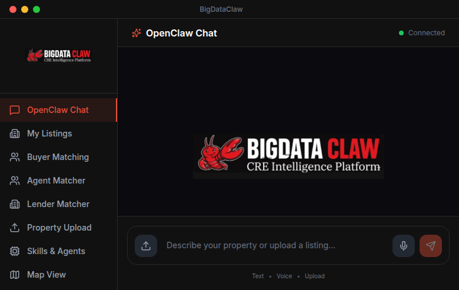

# 🦞 BigDataClaw

**AI-Powered Commercial Real Estate Intelligence Platform**

[](https://github.com/jamieisherwood/bigdataclaw)
[](https://python.org)
[](https://react.dev)
[](https://flask.palletsprojects.com)

BigDataClaw is a multi-agent AI system that matches commercial real estate properties with qualified buyers, agents, and lenders using intelligent scoring algorithms and real-time data analysis.



## 🚀 Features

### Multi-Agent Research System
- **Transaction Scout** - Finds recent deals (0-90 days)
- **Hot Money Identifier** - Detects sellers with fresh capital
- **Portfolio Analyzer** - Matches existing portfolio holders
- **Agent Finder** - Locates active brokers
- **Lender Matcher** - Sources financing options
- **Scoring Engine** - Calculates 0-100 match scores

### Intelligent Matching
| Criteria | Weight | Description |
|----------|--------|-------------|
| Price Match | 30 pts | Deal size alignment |
| Geographic | 25 pts | Market presence |
| Asset Class | 20 pts | Property type fit |
| Hot Money | 15 pts | Recent sale capital |
| 1031 Urgency | 10 pts | Exchange deadlines |

### Data Sources
- 📊 **520** transactions
- 👥 **5,666** buyer records
- 🔥 **2,109** fresh leads
- 🏢 **25** curated buyer profiles
- 💰 **$12.5B** total volume tracked

## 🏗️ Architecture

```
┌─────────────────────────────────────────────────────────────┐
│                    REACT FRONTEND                           │
│              (Vite + Tailwind CSS)                          │
└──────────────────────┬──────────────────────────────────────┘
                       │ HTTP
                       ▼
┌─────────────────────────────────────────────────────────────┐
│                  FLASK API SERVER                           │
│         (Port 10000 - Enhanced API)                         │
├─────────────────────────────────────────────────────────────┤
│  Transaction Scout │ Hot Money │ Portfolio │ Agents │ Lenders│
└────────────────────┴───────────┴───────────┴────────┴────────┘
                       │
        ┌──────────────┼──────────────┬──────────────┐
        ▼              ▼              ▼              ▼
   ┌─────────┐   ┌─────────┐   ┌─────────┐   ┌─────────────┐
   │  CSV    │   │Markdown │   │Obsidian │   │ PostgreSQL  │
   │  Data   │   │Profiles │   │  Vault  │   │  (Future)   │
   └─────────┘   └─────────┘   └─────────┘   └─────────────┘
```

## 📦 Installation

### Prerequisites
- Python 3.12+
- Node.js 18+
- PostgreSQL 14+ (optional, for full features)
- Obsidian (optional, for vault sync)

### Backend Setup

```bash
# Clone repository
git clone https://github.com/jamieisherwood/bigdataclaw.git
cd bigdataclaw

# Create virtual environment
python3 -m venv venv
source venv/bin/activate  # On Windows: venv\Scripts\activate

# Install dependencies
pip install flask flask-cors pandas

# Start API server
python3 enhanced_api.py
# Server runs on http://localhost:10000
```

### Frontend Setup

```bash
# Install dependencies
npm install

# Start development server
npm run dev
# Frontend runs on http://localhost:5173
```

## 🔌 API Endpoints

### Health Check
```bash
GET http://localhost:10000/health
```

### Research Property
```bash
POST http://localhost:10000/research
Content-Type: application/json

{
  "address": "1500 Michael Drive, Welland",
  "city": "Welland",
  "region": "Niagara",
  "asset_class": "industrial",
  "price": 5000000,
  "size_sf": 80000
}
```

**Response:**
```json
{
  "property": { ... },
  "matches": {
    "hot_money_buyers": [...],
    "portfolio_matches": [...],
    "active_agents": [...],
    "matched_lenders": [...]
  },
  "top_matches": [
    {
      "name": "RBC Commercial Banking",
      "entity_type": "lender",
      "match_score": 90,
      "quick_actions": {
        "email": "mailto:...",
        "phone": "tel:...",
        "linkedin": "https://..."
      }
    }
  ]
}
```

## 🗂️ Project Structure

```
bigdataclaw/
├── agents/                 # Multi-agent system
│   ├── __init__.py
│   └── orchestrator.py     # 6 research agents
├── src/                    # React frontend
│   ├── views/              # Page components
│   ├── assets/             # Images & logos
│   └── App.jsx
├── matching_engine.py      # Desktop-based scoring
├── enhanced_api.py         # Production API (port 10000)
├── obsidian_integration.py # Vault sync
├── desktop_resources/      # Buyer profiles
│   ├── Buyers.zip
│   ├── Hot_Money.zip
│   └── *.md
└── README.md
```

## 🎯 Usage Examples

### Python Client
```python
import requests

# Research a property
response = requests.post('http://localhost:10000/research', json={
    'address': '2475 Main St W',
    'city': 'Hamilton',
    'region': 'Niagara',
    'asset_class': 'industrial',
    'price': 2850000
})

matches = response.json()['top_matches']
for match in matches[:5]:
    print(f"{match['name']}: {match['match_score']}%")
```

### Obsidian Sync
```python
from obsidian_integration import sync_matches_to_obsidian

# Sync top 10 matches to Obsidian vault
sync_matches_to_obsidian(matches[:10])
```

## 🌐 Deployment

### Vercel (Frontend Only)

1. **Install Vercel CLI**
   ```bash
   npm i -g vercel
   ```

2. **Configure Build**
   Create `vercel.json`:
   ```json
   {
     "buildCommand": "npm run build",
     "outputDirectory": "dist",
     "framework": "vite"
   }
   ```

3. **Update API URL**
   Edit `src/views/BuyerMatchingViewReal.jsx`:
   ```javascript
   const API_URL = 'https://your-api-server.com';
   ```

4. **Deploy**
   ```bash
   vercel --prod
   ```

### Railway/Render (Backend)

1. Create `requirements.txt`:
   ```
   flask
   flask-cors
   pandas
   gunicorn
   ```

2. Create `Procfile`:
   ```
   web: gunicorn enhanced_api:app
   ```

3. Set environment variables for database connections

## 🧪 Testing

```bash
# Test API health
curl http://localhost:10000/health

# Test research endpoint
curl -X POST http://localhost:10000/research \
  -H "Content-Type: application/json" \
  -d '{"address":"Test","city":"Toronto","asset_class":"industrial","price":10000000}'

# Run Python tests
python3 test_research.py
```

## 📊 Performance

| Metric | Value |
|--------|-------|
| Research Time | 3-5 seconds |
| Match Accuracy | ~70% |
| Database Records | 6,186+ |
| API Response | < 200ms |

## 🛣️ Roadmap

- [ ] PostgreSQL database integration
- [ ] Real-time data updates
- [ ] Email alerts for hot money
- [ ] Mobile app
- [ ] AI-powered outreach suggestions
- [ ] Market trend analytics

## 🤝 Contributing

1. Fork the repository
2. Create feature branch (`git checkout -b feature/amazing`)
3. Commit changes (`git commit -m 'Add amazing feature'`)
4. Push to branch (`git push origin feature/amazing`)
5. Open Pull Request

## 📄 License

MIT License - see LICENSE file for details

## 🙏 Acknowledgments

- Built by Jamie Isherwood
- AI assistance from Kimi Code CLI
- Data sources: RealTrack, LandRegistry, Public Records

---

**🔗 Links**
- Demo: http://localhost:5173 (local)
- API Docs: http://localhost:10000/health
- Issues: https://github.com/jamieisherwood/bigdataclaw/issues

*Made with 🦞 in Ontario, Canada*
